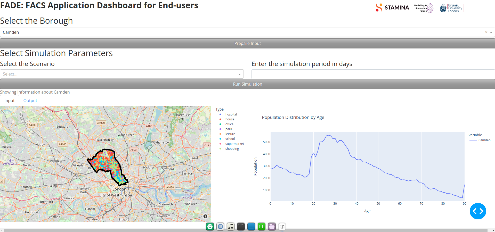
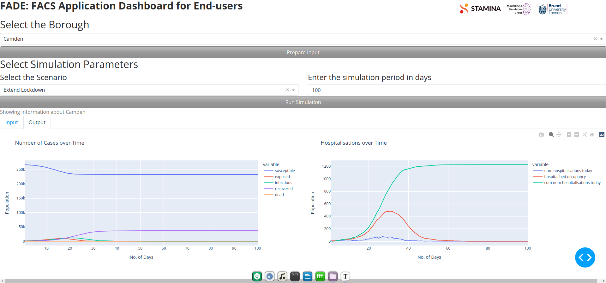

# FADE: FACS Application Dashboard for End-users

## What is FACS?

The Modelling and Simulation Group at the Brunel University London has developed **FACS: Flu And Coronavirus Simulator**, a tool for agent based simulation of spread of infectious diseases such as flu and the novel corona virus. In order to run a simulation for a region, FACS requires certain data related to the region, such as, the locations of houses and other amenities in the region, its age-based demographics, and the government restrictions applied there. Using these input data, FACS makes predictions regarding the future number of cases, number of hospitalisations etc.

## Need for an integrated dashboard

The data required by FACS is in a very specific format (generally as `.csv` and `.yml` files). While the data is generally publicly available, it is almost never in the required format. Moreover, the data is generally collected from multiple sources. Therefore, without an integrated Graphical User Interface (GUI), running a simulation with FACS becomes cumbersome and prone to errors. Even after the run, the results need to be plotted and manually visualised for further analysis.

In order to address these problems, we present FADE, a dashboard that presents a GUI for running FACS. Currently configured for boroughs of London, FADE allows the users to set-up and run FACS simulations within a few clicks. It also plots the summary of the results in a streamlined fashion.

## Tutorial

FADE is a dash application that can be launched in any modern web-browser. In order to run a simulation for a borough, we take the following steps.

1. Select the name of the borough from the drop-down list and click on the **Prepare Input** button. For example, let us select the borough of *Camden* for this tutorial.

   

   The application takes a few seconds to generate the processed input required for FACS. It then allows the user to enter the simulation parameters. It also shows a map of the borough and a plot showing the age-distribution of the population in the borough. On the map, the locations of various amenities and houses are shown.

2. Now, set the simulation parameters. This includes the **Scenario** and the **Simulation Period**. The Simulation period gives the length of simulation in days. The Scenario gives the lock-down or other government measures adopted during the period of simulation. For this tutorial, we select the *Extend Lockdown* scenario from the drop-down and enter *100* as the simulation period in days. Thereafter, we click on the **Run Simulation** button.

   

   The application runs FACS in the background immediately after the button is clicked. *Simulations typically take a longer duration of time to run; so be patient.* On completion, click on the **Output** tab below the **Run Simulation** button to see the output of the program. On the left panel, metrics related to the number of cases over time are shown. On the right panel, metrics related to hospitalisations over time are shown.

## Notes and Salient Features

- Currently, the FACS simulations run with a fixed starting date (which is the 1st March 2020). The user would be allowed to choose a different starting date for the simulation in a future update. The user will also be able to tweak even more simulation parameters in future.
- If a FACS simulation was run previously using FADE, the results of the latest run can be seen without running the simulation again. For this, simply select the borough and click on **Prepare Input**. The results of the last run can be seen then in the **Output** tab before running a new simulation.
- All the plots and maps in the application are interactive. Hence, the user can hover the data point in the plot to see the details or zoom into the maps.
- Clicking on the various legend elements on the maps and plots toggles their visibility. This is very useful in order to visualise individual groups of amenities on the map or isolate certain data from the plots.